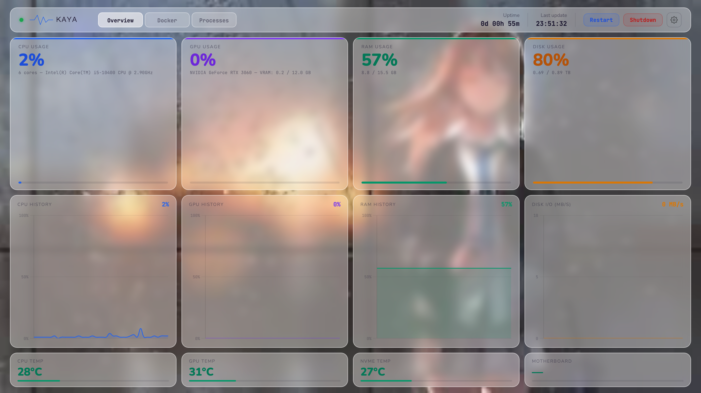

# ∿ Kaya

> A minimal, self-hosted system dashboard for your home server.



Kaya gives you a beautiful at-a-glance view of your machine's CPU, GPU, RAM, disk usage, and temperatures — live, in your browser, with no cloud dependency and no telemetry.

---

## Features

- **Live metrics** — CPU, GPU, RAM, and disk usage updated every 10 seconds
- **History graphs** — rolling 40-point Chart.js sparklines for each metric
- **Temperature monitoring** — CPU, GPU, NVMe, and motherboard temps with colour-coded warnings
- **Disk I/O** — real-time read/write throughput in MB/s
- **Uptime tracking** — formatted days/hours/minutes display
- **Server controls** — restart and shutdown buttons with confirmation modal
- **Glassmorphism UI** — frosted glass cards over a custom wallpaper background
- **Offline detection** — status dot turns red and metrics clear when the backend is unreachable
- **Zero telemetry** — runs entirely on your local network, nothing leaves your machine

---

## Stack

| Layer    | Technology                        |
|----------|-----------------------------------|
| Backend  | Python · FastAPI · psutil · pynvml |
| Frontend | HTML · CSS · JavaScript · Chart.js |
| Fonts    | Nunito · JetBrains Mono (Google Fonts) |

---

## Project Structure

```
Kaya/
├── Backend/
│   ├── main.py          # FastAPI app with /api/metrics, /api/restart, /api/shutdown
│   ├── metrics.py       # psutil + NVML data collection
│   └── requirements.txt
├── Frontend/
│   ├── index.html       # Single-file dashboard
│   ├── style.css        # Glassmorphism UI styles
│   └── assets/
│       ├── brand/       # Logo and icon SVGs
│       └── wallpaper.jpg
├── LICENSE
└── README.md
```

---

## Getting Started

### Prerequisites

- Python 3.10+
- An NVIDIA GPU is optional — the dashboard gracefully handles systems without one

### Installation

**1. Clone the repository**
```bash
git clone https://github.com/sk3tchedlexi/Kaya.git
cd Kaya
```

**2. Install Python dependencies**
```bash
cd Backend
pip install -r requirements.txt
```

**3. Start the backend**
```bash
uvicorn main:app --host 0.0.0.0 --port 9783
```

**4. Open the frontend**

Open `Frontend/index.html` directly in your browser, or serve it with any static file server. Make sure the `API` variable in `index.html` points to your server's IP and port.

```js
const API = "http://<YOUR_SERVER_IP>:9783/api/metrics";
const BASE = "http://<YOUR_SERVER_IP>:9783";
```

---

## Running as a Service (Linux)

To keep Kaya running in the background on boot, create a systemd service:

```bash
sudo nano /etc/systemd/system/kaya.service
```

```ini
[Unit]
Description=Kaya Dashboard Backend
After=network.target

[Service]
ExecStart=/usr/bin/uvicorn main:app --host 0.0.0.0 --port 9783
WorkingDirectory=/path/to/Kaya/Backend
Restart=always
User=your_username

[Install]
WantedBy=multi-user.target
```

```bash
sudo systemctl enable kaya
sudo systemctl start kaya
```

---

## Shutdown & Restart

The dashboard includes Restart and Shutdown buttons that call `sudo shutdown` on the host machine. For these to work, your service user needs passwordless sudo for the shutdown command:

```bash
sudo visudo
```
Add the following line:
```
your_username ALL=(ALL) NOPASSWD: /sbin/shutdown
```

---

## Status

🚧 **Early development** — the project is actively being built. Contributions and feedback are welcome.

Planned features:
- Network interface monitoring (upload/download speeds)
- Running process viewer
- Multi-server support
- Docker container status

---

## License

MIT © [sk3tchedlexi](https://github.com/sk3tchedlexi)
